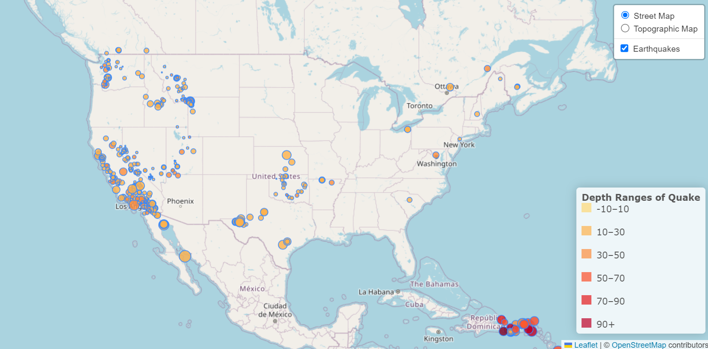

# leaflet-challenge

## Overview
 The United States Geological Survey[USGS], provides scientific data about natural hazards, the health of our ecosystems and environment, and the impacts of climate and land-use change. 
The USGS is interested in building a new set of tools that will allow them to visualize their earthquake data, in order to better educate the public and other government organizations on issues facing our planet.

## Purpose
The goal was to create a world map visualization loaded with information regarding the incidences of all earthquakes that have occured in the past week. 

## Dataset
The dataset referred to above, is provided in GeoJSON format by the USGS. It has been retrieved through the d3 library call and the features data has been utilized to create the visualization with certain pre-determined criteria listed below:

## Steps
The radius is adjusted, based on the recorded magnitude of the earthquake.
The color of the circular maker is dependent on the depth of the quake - deeper the earthquake, darker is the color of the marker.
The depth categories have been chosen after studying different maps for reference.

## Instruction:

The app is hosted at the following site:

